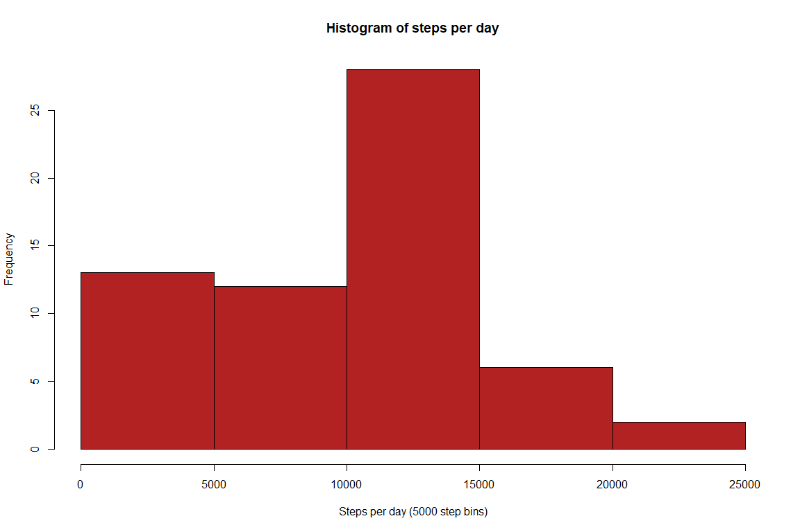
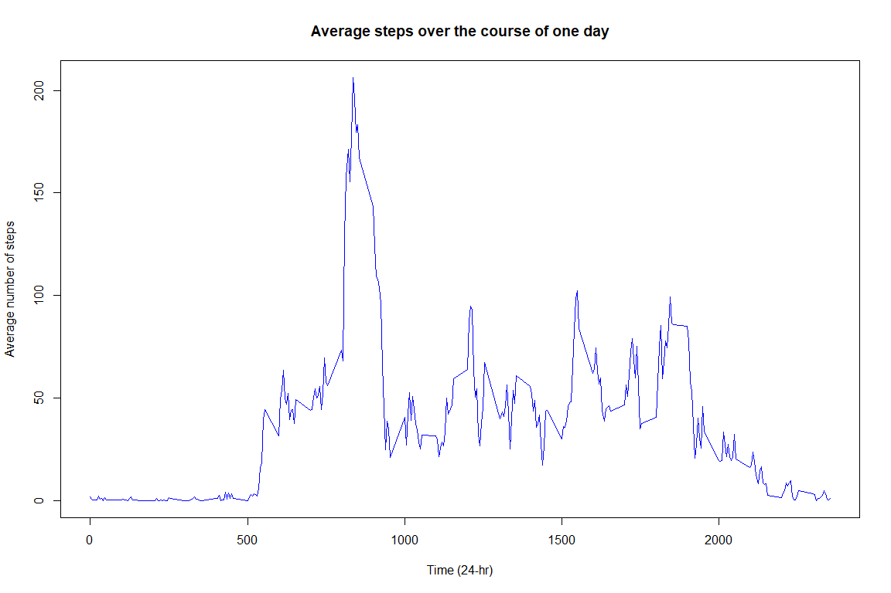
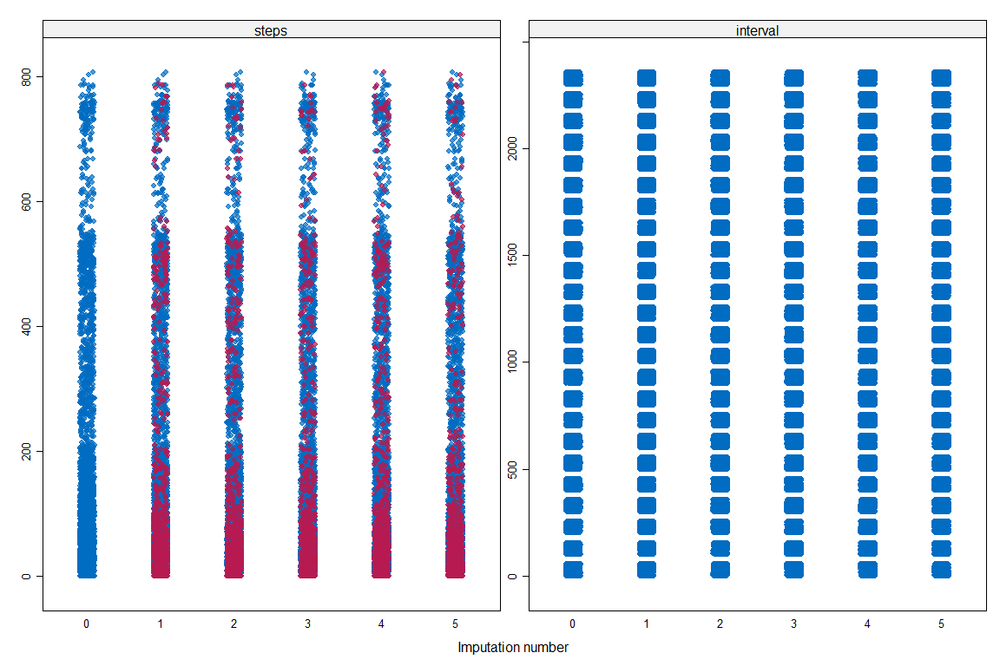
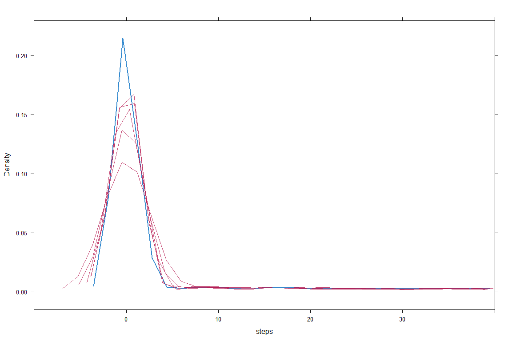
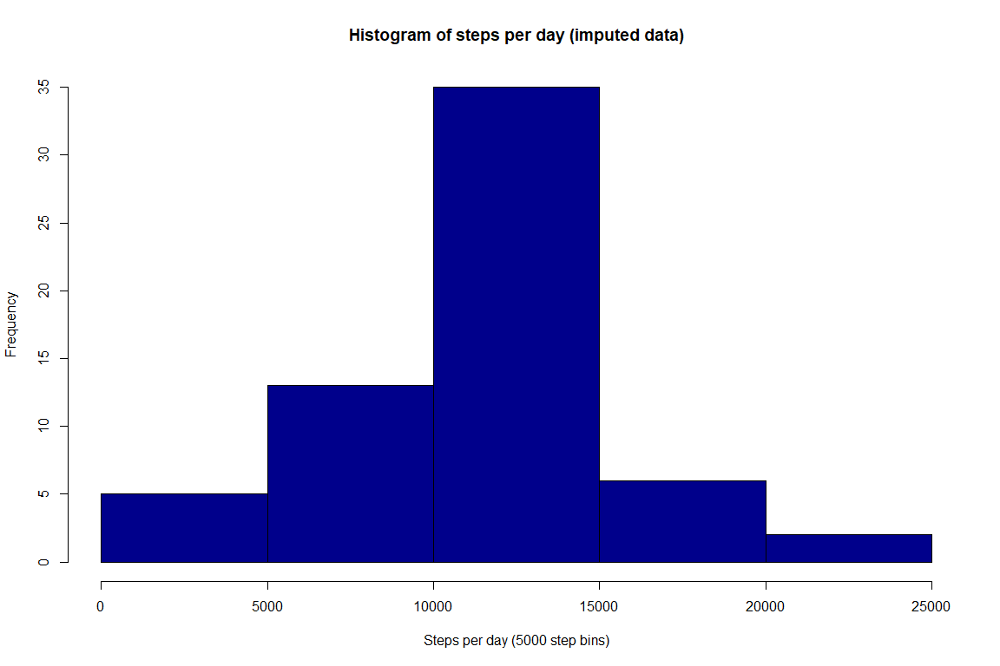
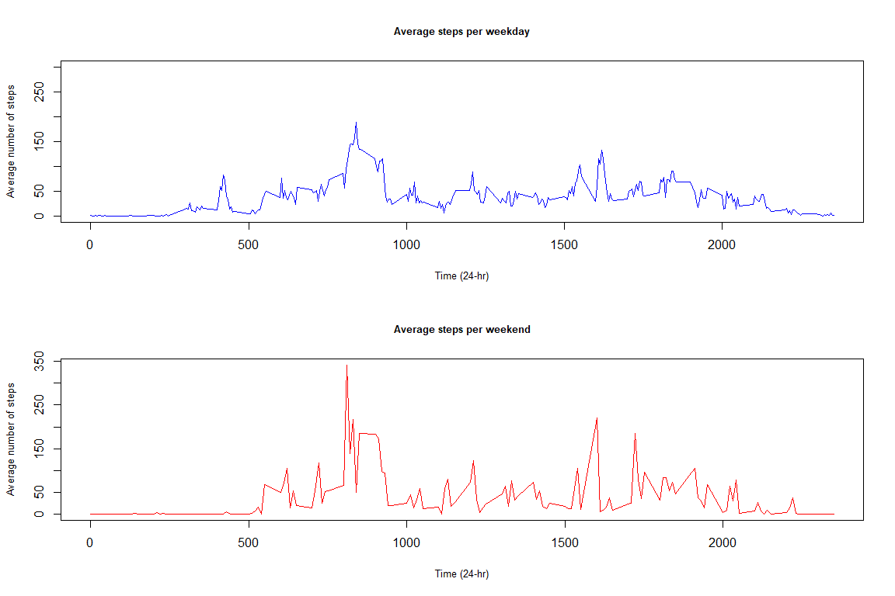

# Reproducible Research - Week 2 assignment
Jonathon Pye  
November 22, 2017  


# Loading and preprocessing the data
Starting off by loading in the data and converting the date to posixct. Have a look at some summary data.


```r
data <- read.csv('/Users/JP/OneDrive/Coursera Assignments/activity.csv', header = T) # Load in the data
data$date <- as.POSIXct(data$date) # convert to posixct

summary(data) # lets take a look..2304 NA values in 'Steps'.
```

```
##      steps             date                        interval     
##  Min.   :  0.00   Min.   :2012-10-01 00:00:00   Min.   :   0.0  
##  1st Qu.:  0.00   1st Qu.:2012-10-16 00:00:00   1st Qu.: 588.8  
##  Median :  0.00   Median :2012-10-31 00:00:00   Median :1177.5  
##  Mean   : 37.38   Mean   :2012-10-31 00:06:53   Mean   :1177.5  
##  3rd Qu.: 12.00   3rd Qu.:2012-11-15 00:00:00   3rd Qu.:1766.2  
##  Max.   :806.00   Max.   :2012-11-30 00:00:00   Max.   :2355.0  
##  NA's   :2304
```

# What is mean total number of steps taken per day?
Question 1: Calculate the total number of steps taken per day.

```r
# Create data frame split by date with sum() steps for each day
day_split <- data.frame(split(data$steps, data$date))

# ...then another with with sum() steps for each day
sum_steps_per_day <- lapply(day_split, sum, na.rm=TRUE)
head(sum_steps_per_day)
```

```
## $X2012.10.01
## [1] 0
## 
## $X2012.10.02
## [1] 126
## 
## $X2012.10.03
## [1] 11352
## 
## $X2012.10.04
## [1] 12116
## 
## $X2012.10.05
## [1] 13294
## 
## $X2012.10.06
## [1] 15420
```

Question 2: Make a histogram of the total number of steps taken each day

```r
# Question 2.
# Histogram of steps per day (5000 step bins)
hist(as.numeric(sum_steps_per_day), main = "Histogram of steps per day", 
     xlab = "Steps per day (5000 step bins)", col = "firebrick") 
```

<!-- -->

Question 3: Calculate and report the mean and median of the total number of steps taken per day

```r
# Question 3.
# Mean steps per day
mean_steps_per_day <- mean(as.numeric(sum_steps_per_day), na.rm = TRUE)
mean_steps_per_day
```

```
## [1] 9354.23
```

```r
# Median steps per day
median_steps_per_day <- median(as.numeric(sum_steps_per_day), na.rm = TRUE)
median_steps_per_day
```

```
## [1] 10395
```

# What is the average daily activity pattern?
Question 1: Make a time series plot (i.e. type = "l") of the 5-minute interval (x-axis) and the average number of steps taken, averaged across all days (y-axis)

```r
# Generate x-axis for plot
head(data$date) # Get start date
```

```
## [1] "2012-10-01 AEST" "2012-10-01 AEST" "2012-10-01 AEST" "2012-10-01 AEST"
## [5] "2012-10-01 AEST" "2012-10-01 AEST"
```

```r
tail(data$date) # Get end date
```

```
## [1] "2012-11-30 AEDT" "2012-11-30 AEDT" "2012-11-30 AEDT" "2012-11-30 AEDT"
## [5] "2012-11-30 AEDT" "2012-11-30 AEDT"
```

```r
plot_dates <- seq.Date(from=as.Date("2012-10-01"), to=as.Date("2012-11-30"), by="day")

# Create a data frame with averaged activity condensed into one day (5 min bins)
averaged_activity <- as.data.frame(rowMeans(day_split, na.rm = T))

date_split <- split(data, data$date) # Split by date
# date_split <- split(data[-2:3,], data$date) # Split by date
# date_split <- data.frame(split(data$date, data$date))
time_x <- data.frame(as.numeric(date_split$`2012-10-01`$interval))

# Plot showing average steps over one day
plot(x = time_x$as.numeric.date_split..2012.10.01..interval., y = averaged_activity$`rowMeans(day_split, na.rm = T)`, type = "l", 
     main = "Average steps over the course of one day",
     xlab = "Time (24-hr)", ylab = "Average number of steps", col = "blue", lwd = 1.5)
```

<!-- -->

Question 2: Which 5-minute interval, on average across all the days in the dataset, contains the maximum number of steps?
As the results below show, the 8:35AM - 8:40AM interval contains the maximum number of steps on average.

```r
# Highest amount of steps in the sampling period
max_activity <- max(averaged_activity$`rowMeans(day_split, na.rm = T)`)
# exploring the data and sorting by descending in the viewer, row 104 has the highest value
# ...So lets find the corresponding time at row 104
time_of_max_steps <- time_x$as.numeric.date_split..2012.10.01..interval.[104]
time_of_max_steps
```

```
## [1] 835
```

# Imputing missing values
Question 1: Calculate and report the total number of missing values in the dataset (i.e. the total number of rows with NAs)

```r
sum(is.na(data))
```

```
## [1] 2304
```

Question 2: Devise a strategy for filling in all of the missing values in the dataset.

Multivariate imputation by chained equations package (mice) was used, with random forest selected as the method. Inspection of the imputed data revealed it may be overestimating step counts where it should be imputing '0' values, however imputed values >10 steps match the observed distribution very closely.

```r
# Let's try using the 'multivariate imputation by chained equations' package (mice)
library(mice)
```

```
## Loading required package: lattice
```

```r
predict_matrix <- as.matrix(data[, -2])
test_data <- mice(data = predict_matrix, m = 5, method = 'rf') # Let's do random forest
```

```
## 
##  iter imp variable
##   1   1  steps
##   1   2  steps
##   1   3  steps
##   1   4  steps
##   1   5  steps
##   2   1  steps
##   2   2  steps
##   2   3  steps
##   2   4  steps
##   2   5  steps
##   3   1  steps
##   3   2  steps
##   3   3  steps
##   3   4  steps
##   3   5  steps
##   4   1  steps
##   4   2  steps
##   4   3  steps
##   4   4  steps
##   4   5  steps
##   5   1  steps
##   5   2  steps
##   5   3  steps
##   5   4  steps
##   5   5  steps
```

```r
# Let's test the quality of the imputation
stripplot(test_data, pch = 20, cex = 1.2) # Observed/imputed looks okay but lets do more testing
```

<!-- -->

```r
densityplot(test_data, xlim = c(-10, 40)) 
```

<!-- -->

```r
# Might be overestimating the values a little, but >10 steps is very close to observed data
```

Question 3: Create a new dataset that is equal to the original dataset but with the missing data filled in.

As you can see below, all missing data has been filled in when compared to the original.

```r
# Complete the dataset - replacing missing values
completedData <- complete(test_data,1)

sum(is.na(data)) # Original
```

```
## [1] 2304
```

```r
sum(is.na(completedData)) # Versus completed dataset
```

```
## [1] 0
```

Question 4: Make a histogram of the total number of steps taken each day and Calculate and report the mean and median total number of steps taken per day. Do these values differ from the estimates from the first part of the assignment? What is the impact of imputing missing data on the estimates of the total daily number of steps?

Histogram:

```r
day_split_imputed_data <- data.frame(split(completedData$steps, data$date)) # Split the data frame by day to calc. step values

sum_steps_per_day_imputed_data <- lapply(day_split_imputed_data, sum, na.rm=TRUE) # Calc. total number steps taken each day

# Histogram of steps per day (5000 step bins) for imputed data
hist(as.numeric(sum_steps_per_day_imputed_data), main = "Histogram of steps per day (imputed data)", 
     xlab = "Steps per day (5000 step bins)", col = "darkblue") 
```

<!-- -->

Mean and medican total number of steps taken per day

```r
# Mean steps per day
mean_steps_per_day_imputed_data <- mean(as.numeric(sum_steps_per_day_imputed_data), na.rm = TRUE)
mean_steps_per_day_imputed_data
```

```
## [1] 10863.31
```

```r
# Median steps per day
median_steps_per_day_imputed_data <- median(as.numeric(sum_steps_per_day_imputed_data), na.rm = TRUE)
median_steps_per_day_imputed_data
```

```
## [1] 11015
```

Testing the observed versus imputed datasets. 
One can observe a slightly increased step count with the imputed dataset - as per the density plots shown previously, the imputation model was slightly overestimating the step counts, however according to the t-test not significantly so.

```r
# Test how different the values are (observed versus imputed)
# Total daily number of steps
t.test(x = as.numeric(sum_steps_per_day), y = as.numeric(sum_steps_per_day_imputed_data))
```

```
## 
## 	Welch Two Sample t-test
## 
## data:  as.numeric(sum_steps_per_day) and as.numeric(sum_steps_per_day_imputed_data)
## t = -1.7486, df = 110.9, p-value = 0.08312
## alternative hypothesis: true difference in means is not equal to 0
## 95 percent confidence interval:
##  -3219.2065   201.0426
## sample estimates:
## mean of x mean of y 
##   9354.23  10863.31
```

# Are there differences in activity patterns between weekdays and weekends?
Question 1: Create a new factor variable in the dataset with two levels - "weekday" and "weekend" indicating whether a given date is a weekday or weekend day.

```r
weekends <- list("Saturday", "Sunday")
completedData$date <- plot_dates # Add a column with the dates to the imputed dataset
completedData$split_week <- ifelse(weekdays(completedData$date) != weekends, "Weekday", "Weekend")
completedData <- dplyr::arrange(completedData, date, interval) # Arrange the date by date and interval
completedData$split_week <- as.factor(completedData$split_week)
levels(completedData$split_week)
```

```
## [1] "Weekday" "Weekend"
```

Question 2: Make a panel plot containing a time series plot (i.e. type = "l") of the 5-minute interval (x-axis) and the average number of steps taken, averaged across all weekday days or weekend days (y-axis).

```r
week_weekend <- split(completedData, completedData$split_week)
Weekday_averages <- split(week_weekend$Weekday$steps, as.POSIXct(week_weekend$Weekday$date))
Weekend_averages <- split(week_weekend$Weekend$steps, as.POSIXct(week_weekend$Weekend$date))
Weekend_time <- split(week_weekend$Weekend$interval, as.POSIXct(week_weekend$Weekend$date))
# completedData$split_week[completedData$split_week == "Weekend"] # This answers the question

imputed_weekday_sum_steps <- rowMeans(as.data.frame(Weekday_averages))
imputed_weekend_sum_steps <- rowMeans(as.data.frame(Weekend_averages))

par(mfrow=c(2,1))
weekday_plot <- plot(x = time_x$as.numeric.date_split..2012.10.01..interval., y = imputed_weekday_sum_steps, type = "l", 
     main = "Average steps per weekday",
     xlab = "Time (24-hr)", ylab = "Average number of steps", col = "blue", lwd = 1.7, 
     cex.main = 0.8, cex.lab = 0.8, ylim = c(0, 300))

weekend_plot <- plot(x = Weekend_time$`2012-10-06 10:00:00`, y = imputed_weekend_sum_steps, type = "l", 
     main = "Average steps per weekend",
     xlab = "Time (24-hr)", ylab = "Average number of steps", col = "red", lwd = 1.7, 
     cex.main = 0.8, cex.lab = 0.8)
```

<!-- -->
